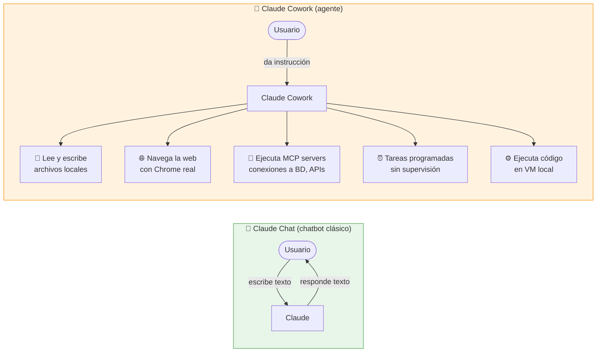
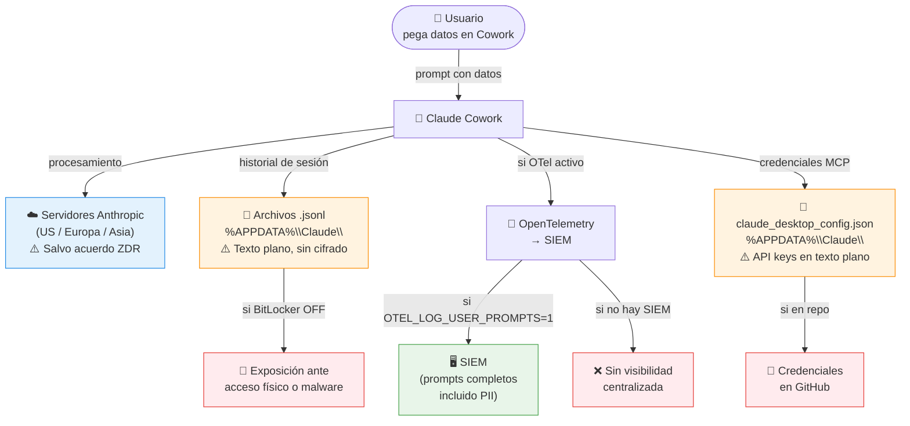
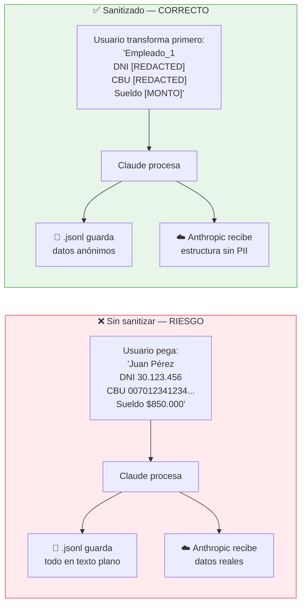
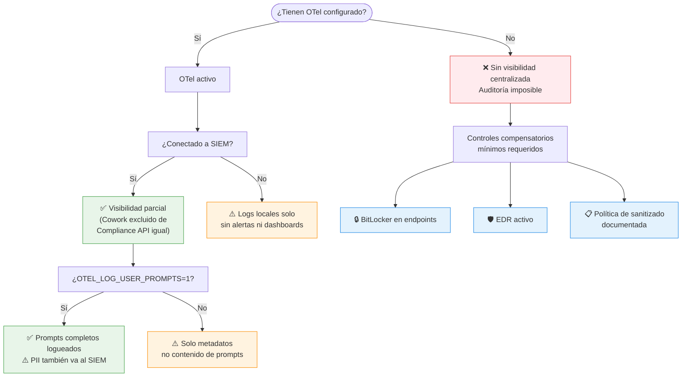
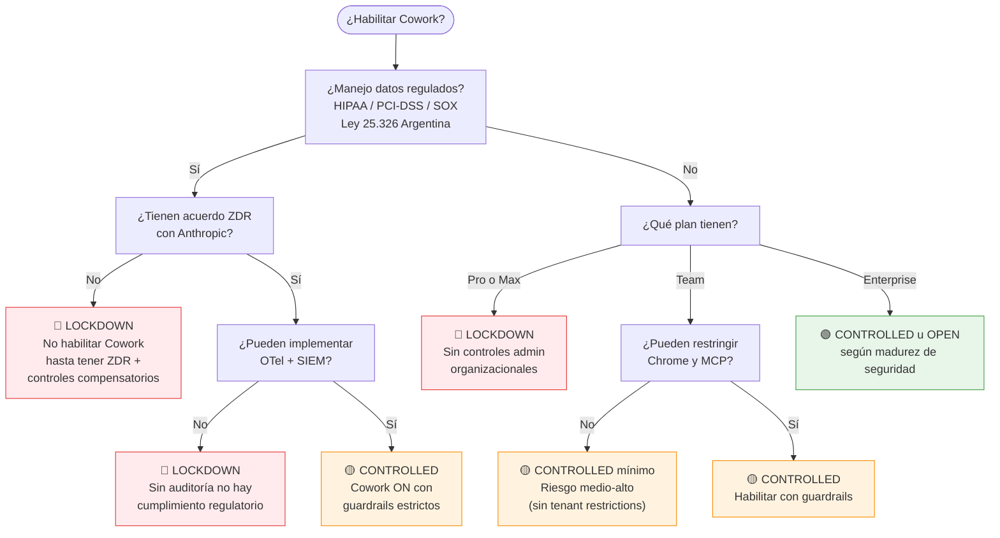

# Claude Cowork — Diagramas para Presentación a Cliente

---

## Diagrama 1 — ¿Qué hace Cowork que un chatbot no hace?

> **Mensaje clave:** Cowork no es un chatbot — toma acciones reales en el sistema. El riesgo es radicalmente distinto.

---

## Diagrama 2 — ¿A dónde van los datos que le paso a Cowork?

---

## Diagrama 3 — El problema del PII sin sanitizar

> **Regla práctica:** Claude no necesita el valor real para hacer el trabajo — necesita la estructura. Reemplazar antes de pegar no cambia la calidad del resultado, pero elimina la exposición.

---

## Diagrama 4 — Visibilidad según configuración

---

## Diagrama 5 — ¿Puedo habilitar Cowork? Árbol de decisión

---

## Diagrama 6 — Mapa de controles por área

```mermaid
flowchart LR
    subgraph PREV["🛡️ Prevención"]
        P1["Sanitizado de PII\nantes de usar Cowork"]
        P2["Chrome deshabilitado\no con allowlist"]
        P3["MCP servers\nallowlisteados"]
        P4["Instrucciones globales\nantiinyección"]
        P5["Tenant restrictions\n(Enterprise)"]
    end

    subgraph DET["👁️ Detección"]
        D1["OpenTelemetry\n→ SIEM"]
        D2["EDR con alerta en\n%APPDATA%\\Claude\\"]
        D3["Revisión semanal\nde tareas programadas"]
    end

    subgraph RESP["🚨 Respuesta"]
        R1["Kill-switch:\nCowork OFF desde admin"]
        R2["Playbook de IR\npara incidentes Cowork"]
        R3["Rotación de credenciales\nMCP servers"]
    end

    subgraph BASE["🏗️ Base"]
        B1["BitLocker en endpoints"]
        B2["SSO + SCIM"]
        B3["Política de clasificación\nde datos documentada"]
        B4["Training obligatorio\na usuarios"]
    end

    BASE --> PREV
    BASE --> DET
    PREV --> DET
    DET --> RESP
```

---

*Basado en: [[Sources/Harmonic Security - Securing Claude Cowork]] y documento interno "Uso de Cowork en entornos empresariales" (Gustavo Marcos, abril 2026)*
*Ver guía de auditoría completa: [[Guides/Claude Cowork - Evidencias a Solicitar para Auditoría]]*
