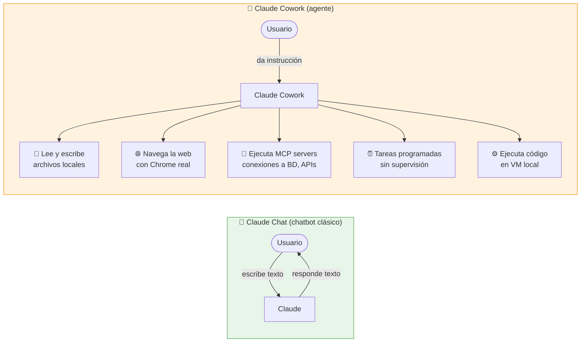
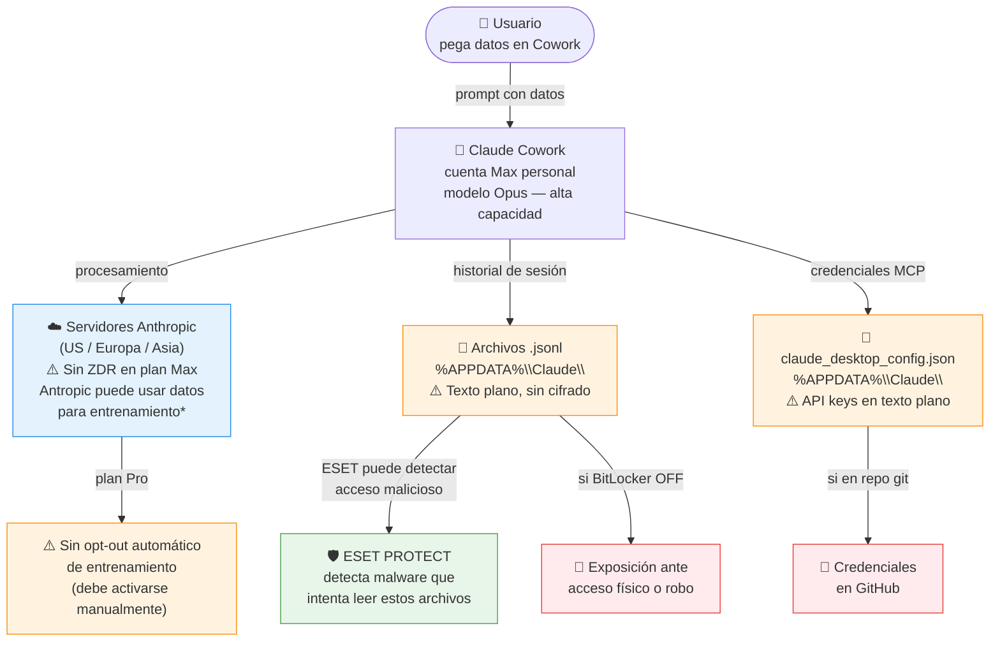
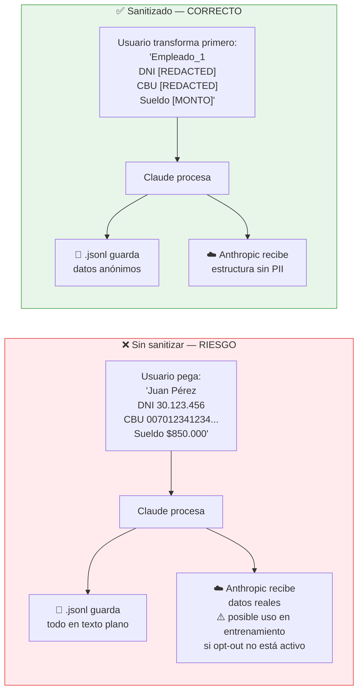
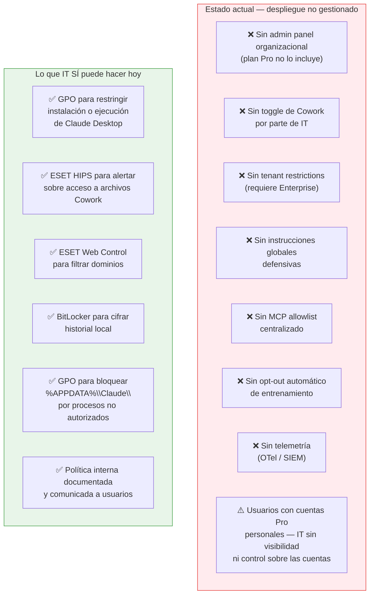
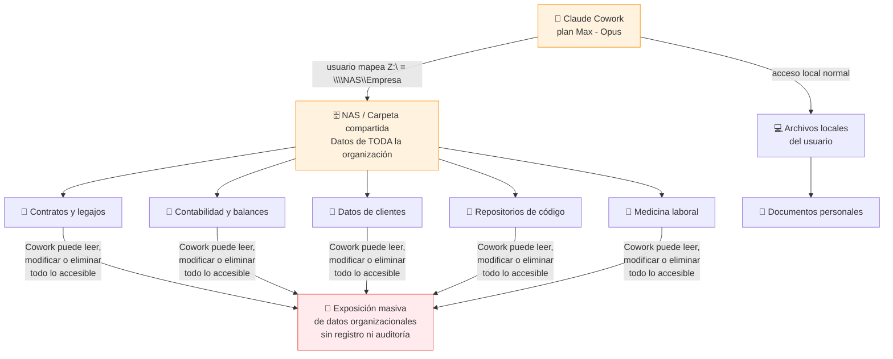
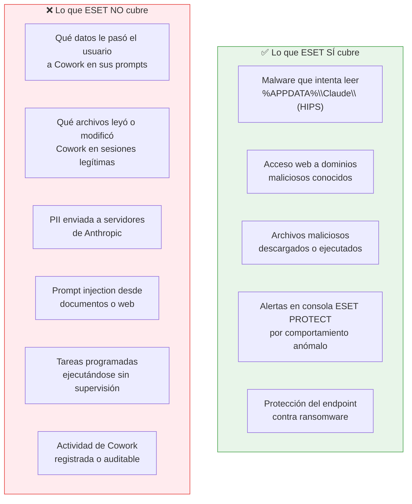

# Claude Cowork — Guía de Seguridad Empresarial

> Guía completa para equipos IT y usuarios finales sobre el uso seguro de Claude Cowork en entornos empresariales.
> Preparada por Gustavo Marcos | Abril 2026

**Entorno de referencia:**
- Endpoints: Windows 10/11
- Directorio: Active Directory local (on-premise)
- Plan Claude: Max (cuentas personales de usuarios — modelos Opus, límites de uso elevados)
- Despliegue: no gestionado — usuarios instalaron Claude por su cuenta
- Almacenamiento compartido: NAS y carpetas de red del dominio
- Protección endpoint: ESET PROTECT Entry cloud (Endpoint & Server Security)
- Telemetría centralizada: ninguna (sin OTel, sin SIEM)

---

## Índice

1. [¿Qué es Claude Cowork y por qué es diferente?](#1-qué-es-claude-cowork-y-por-qué-es-diferente)
2. [¿A dónde van los datos?](#2-a-dónde-van-los-datos)
3. [El problema del PII sin sanitizar](#3-el-problema-del-pii-sin-sanitizar)
4. [Estado actual del entorno — diagnóstico](#4-estado-actual-del-entorno--diagnóstico)
5. [Riesgo específico: NAS y carpetas compartidas](#5-riesgo-específico-nas-y-carpetas-compartidas)
6. [Visibilidad real con ESET — qué cubre y qué no](#6-visibilidad-real-con-eset--qué-cubre-y-qué-no)
7. [Controles disponibles en este entorno](#7-controles-disponibles-en-este-entorno)
8. [Hoja de ruta para recuperar control](#8-hoja-de-ruta-para-recuperar-control)
9. [Evidencias a relevar en auditoría (equipo IT)](#9-evidencias-a-relevar-en-auditoría-equipo-it)
10. [Guía de uso seguro para usuarios](#10-guía-de-uso-seguro-para-usuarios)

---

## 1. ¿Qué es Claude Cowork y por qué es diferente?

Claude Cowork no es un chatbot. A diferencia del chat web, Cowork puede tomar acciones directas sobre el sistema.



> **Mensaje clave:** Cowork toma acciones reales en el sistema. El riesgo es radicalmente distinto al de un chatbot.

---

## 2. ¿A dónde van los datos?



**\* Plan Max — dato importante:** Max ofrece acceso a modelos más capaces (Opus) con límites de uso significativamente mayores (5x o 20x según tier). Esto **amplifica el riesgo agentico**: una tarea programada con Opus tiene mayor capacidad de razonamiento y acción autónoma que en planes inferiores. En términos de controles organizacionales, Max es idéntico a Pro — sin admin panel, sin toggle, sin tenant restrictions. El opt-out de entrenamiento tampoco es automático: debe activarse manualmente por cada usuario.

---

## 3. El problema del PII sin sanitizar

**PII** (*Personally Identifiable Information*) son datos que identifican a una persona: DNI, CUIL/CUIT, CBU/CVU, datos médicos, salarios, emails y nombres de clientes. En Argentina aplica la **Ley 25.326**.

**"PII sin sanitizar"** significa pasarle esos datos reales a Cowork sin anonimizarlos antes. ESET no puede detectar ni prevenir este tipo de exposición — ocurre dentro de una sesión legítima del usuario.



> **Regla práctica:** Claude no necesita el valor real para hacer el trabajo — necesita la estructura. Reemplazar antes de pegar no cambia la calidad del resultado, pero elimina la exposición.

---

## 4. Estado actual del entorno — diagnóstico



**Conclusión del diagnóstico:** este es el escenario de mayor exposición posible para Cowork. La organización no tiene ningún control sobre cómo los usuarios usan la herramienta, qué datos le pasan, ni qué hace con ellos. El uso de modelos Opus (plan Max) agrava el riesgo en tareas autónomas. La única palanca de control inmediata es GPO + ESET + restricciones de acceso a NAS + política de uso comunicada a los usuarios.

---

## 5. Riesgo específico: NAS y carpetas compartidas

El NAS y las carpetas compartidas del dominio representan la superficie de ataque más crítica en este entorno. A diferencia de los archivos locales del usuario, el NAS contiene datos de toda la organización — y Cowork puede acceder a todo lo que el usuario tenga montado o mapeado.

### Por qué el NAS amplifica el riesgo



### Escenarios de riesgo concretos

| Escenario | Cómo ocurre | Impacto |
|---|---|---|
| Cowork lee carpetas completas del NAS | Usuario le dice "analizá la carpeta de clientes en Z:\" | Todos los archivos accesibles van al contexto — y a Anthropic |
| Tarea programada sobre carpeta compartida | Tarea nocturna que "resume novedades" en \\NAS\Empresa | Corre sin supervisión sobre datos de toda la org |
| Prompt injection desde archivo en NAS | Archivo Word con instrucciones ocultas en carpeta compartida | Claude ejecuta instrucciones del atacante con acceso al NAS |
| Modificación accidental de archivos compartidos | Cowork escribe en carpeta donde el usuario tiene permisos de escritura | Sin rollback si no hay versionado en el NAS |
| PII de toda la org en historial local | Cowork procesa planillas de RRHH del NAS | DNI/CUIL/CBU de todos los empleados en `.jsonl` del usuario |

### Controles específicos para NAS

#### En el NAS / servidor de archivos

| Control | Cómo implementarlo | Efecto |
|---|---|---|
| Permisos de solo lectura para usuarios de Cowork | NTFS: quitar Write/Modify en carpetas sensibles | Cowork puede leer pero no modificar ni eliminar |
| Carpeta dedicada para trabajo con Cowork | Crear `\\NAS\CoworkSandbox\[usuario]\` con permisos acotados | Cowork opera en área controlada, aislado del resto del NAS |
| Auditoría de acceso en carpetas críticas | Windows: habilitar Object Access Auditing en carpetas sensibles | Registro de qué archivos abrió cada usuario (incluido Cowork) |
| Versionado o snapshots | Habilitar Shadow Copies / snapshots en NAS | Permite recuperar archivos modificados o eliminados accidentalmente |
| Separar carpetas por sensibilidad | Estructura: `/Publico`, `/Interno`, `/Confidencial`, `/Restringido` | Facilita aplicar permisos granulares y restringir scope de Cowork |

#### En cada endpoint via `settings.json`

Bloquear el acceso de Cowork a rutas de red sensibles directamente en la configuración local:

```json
{
  "permissions": {
    "deny": [
      "Read(\\\\NAS\\RRHH\\**)",
      "Read(\\\\NAS\\Contabilidad\\**)",
      "Read(\\\\NAS\\Medicina Laboral\\**)",
      "Write(\\\\**)",
      "Delete(\\\\**)"
    ]
  }
}
```

> **Nota:** las reglas `Write` y `Delete` con `\\\\**` bloquean escritura y eliminación en **cualquier ruta de red** — Cowork solo puede leer de carpetas explícitamente no bloqueadas.

#### Via GPO (Active Directory)

| Control | GPO | Efecto |
|---|---|---|
| Bloquear montaje de unidades de red para Claude | Software Restriction: denegar acceso a UNC paths desde `claude.exe` | Claude no puede acceder a ninguna ruta `\\servidor\` |
| Auditoría de acceso a objetos | `Computer Configuration → Windows Settings → Security Settings → Audit Policy → Audit Object Access` | Registra accesos al NAS en Event Log |
| Restringir qué carpetas se mapean por GPO | Drive Maps en GPO Preferences | Mapear solo carpetas necesarias, no todo el NAS |

#### Regla para usuarios

> Antes de darle a Cowork acceso a una carpeta de red, preguntate: **¿estaría cómodo si Cowork leyera todo el contenido de esta carpeta y lo enviara a servidores externos?** Si la respuesta es no, no le des acceso.

---

## 6. Visibilidad real con ESET — qué cubre y qué no



### Qué configurar en ESET para Cowork

| Configuración | Dónde | Qué hace |
|---|---|---|
| Regla HIPS: alerta si proceso externo accede a `%APPDATA%\Claude\` | ESET PROTECT cloud → Políticas → HIPS | Detecta malware intentando robar historial |
| Web Control: bloquear categorías de riesgo | ESET PROTECT cloud → Políticas → Web Control | Limita navegación de Chrome de Cowork |
| Device Control: bloquear USB | ESET PROTECT cloud → Políticas → Device Control | Previene exfiltración física del historial |
| Reporte semanal de amenazas por endpoint | ESET PROTECT cloud → Informes | Visibilidad mínima de actividad |

---

## 7. Controles disponibles en este entorno

Con AD local, Windows 10/11, NAS compartido y plan Max, los controles posibles son los siguientes:

### Via GPO (Active Directory)

| Control | Mecanismo GPO | Efecto |
|---|---|---|
| Bloquear instalación de Claude Desktop | Software Restriction Policies o AppLocker | Impide nuevas instalaciones en equipos del dominio |
| Restringir ejecución de `claude.exe` | AppLocker → Executable Rules | Solo usuarios autorizados pueden correr Cowork |
| Proteger `%APPDATA%\Claude\` de acceso externo | ACLs via GPO Preferences | Endurece el acceso al historial local |
| Forzar BitLocker en todos los endpoints | `Computer Configuration → Administrative Templates → BitLocker` | Cifra el historial local automáticamente |
| Auditoría de acceso a objetos en NAS | `Security Settings → Audit Policy → Audit Object Access` | Registra accesos al NAS por usuario, incluido Cowork |
| Restringir drive mappings | Drive Maps en GPO Preferences | Mapear solo carpetas necesarias, no el NAS completo |

### Via ESET PROTECT cloud

| Control | Configuración | Efecto |
|---|---|---|
| HIPS: alerta en `%APPDATA%\Claude\` | Regla personalizada en política HIPS | Detecta acceso malicioso al historial |
| Web Control | Bloquear categorías: finanzas, salud, cloud consoles | Reduce superficie de prompt injection |
| Device Control | Bloquear USB en equipos con Cowork | Previene exfiltración física del historial |

### Via NAS / servidor de archivos

| Control | Implementación | Efecto |
|---|---|---|
| Permisos de solo lectura en carpetas sensibles | NTFS: quitar Write/Modify para usuarios que usan Cowork | Cowork no puede modificar ni eliminar archivos compartidos |
| Carpeta sandbox dedicada | Crear `\\NAS\CoworkSandbox\[usuario]\` | Cowork opera en área aislada del resto del NAS |
| Shadow Copies / snapshots | Habilitar en volúmenes del NAS | Recuperación ante modificaciones accidentales |
| Auditoría de acceso | Object Access Auditing en carpetas críticas | Registro de qué archivos abrió Cowork |

### Via `settings.json` por endpoint

Bloquear rutas de red sensibles directamente en la configuración de Claude:

```json
{
  "permissions": {
    "deny": [
      "Read(\\\\NAS\\RRHH\\**)",
      "Read(\\\\NAS\\Contabilidad\\**)",
      "Read(\\\\NAS\\Medicina Laboral\\**)",
      "Write(\\\\**)",
      "Delete(\\\\**)"
    ]
  }
}
```

### Via política interna

- Política de uso aceptable documentada y firmada por usuarios
- Checklist de sanitizado de PII antes de usar Cowork
- Regla explícita: no dar acceso a carpetas de red completas — solo subcarpetas del proyecto
- Procedimiento de reporte ante comportamiento anómalo
- Verificación manual periódica de tareas programadas activas

---

## 8. Hoja de ruta para recuperar control

### Inmediato — sin cambios de infraestructura

- [ ] Comunicar a usuarios la política de uso aceptable y las reglas de sanitizado
- [ ] Verificar que BitLocker esté activo en todos los endpoints con Cowork (`manage-bde -status C:`)
- [ ] Crear regla HIPS en ESET PROTECT cloud para `%APPDATA%\Claude\`
- [ ] Solicitar a cada usuario activar el opt-out de entrenamiento (claude.ai → Settings → Privacy)
- [ ] Relevar qué usuarios tienen Cowork instalado y qué conectores/MCP tienen activos
- [ ] Aplicar permisos de solo lectura en carpetas sensibles del NAS para usuarios que usan Cowork
- [ ] Crear carpeta sandbox en NAS (`\\NAS\CoworkSandbox\`) para trabajo con Cowork
- [ ] Desplegar `settings.json` con reglas `deny` para rutas de red sensibles en cada endpoint

### Corto plazo — con GPO

- [ ] Implementar AppLocker para controlar qué usuarios pueden ejecutar Claude Desktop
- [ ] Forzar BitLocker via GPO en todos los endpoints del dominio
- [ ] Aplicar Web Control en ESET para limitar dominios accesibles desde Cowork
- [ ] Habilitar auditoría de acceso a objetos en carpetas críticas del NAS
- [ ] Habilitar Shadow Copies en volúmenes del NAS
- [ ] Revisar y restringir drive mappings via GPO — no mapear el NAS completo

### Mediano plazo — decisión estratégica

- [ ] Evaluar migración a plan **Team o Enterprise**
  - Team agrega: toggle de Cowork, opt-out automático de entrenamiento
  - Enterprise agrega: tenant restrictions, SAML/SCIM, Chrome admin, red egress controlada
- [ ] Si se mantiene Max: formalizar que Cowork **no está aprobado para datos regulados ni acceso irrestricto al NAS**

---

## 9. Evidencias a relevar en auditoría (equipo IT)

> **Contexto:** no hay políticas de Cowork desplegadas. El objetivo es relevar el estado real de cada endpoint y establecer una línea de base.

### 8.1 Relevamiento por endpoint

```powershell
# Verificar si Claude Desktop está instalado
Get-ItemProperty "HKLM:\Software\Microsoft\Windows\CurrentVersion\Uninstall\*" |
  Where-Object DisplayName -like "*Claude*" | Select-Object DisplayName, DisplayVersion

# Verificar si BitLocker está activo
manage-bde -status C:

# Listar archivos de configuración presentes
Get-ChildItem "$env:APPDATA\Claude\" -ErrorAction SilentlyContinue
Get-ChildItem "$env:USERPROFILE\.claude\" -ErrorAction SilentlyContinue

# Ver tamaño del historial (indica nivel de uso)
(Get-ChildItem "$env:APPDATA\Claude\*.jsonl" -ErrorAction SilentlyContinue |
  Measure-Object -Property Length -Sum).Sum / 1MB
```

### 8.2 Archivos críticos a inspeccionar

| Archivo | Ruta | Qué verificar |
|---|---|---|
| `claude_desktop_config.json` | `%APPDATA%\Claude\` | Que no tenga credenciales hardcodeadas en campo `env` |
| `settings.json` | `%USERPROFILE%\.claude\` | Si tiene campo `deny` con rutas sensibles |
| `*.jsonl` (historial) | `%APPDATA%\Claude\` | Presencia de PII con búsqueda de patrones |
| `.claude.json` | `%USERPROFILE%\` | Repos marcados como confiables |

**Búsqueda de PII en historial:**

```powershell
Select-String -Path "$env:APPDATA\Claude\*.jsonl" `
  -Pattern "\b\d{7,8}\b|\b\d{2}-\d{7,8}-\d{1}\b|\b\d{22}\b" |
  Select-Object -First 20
```

### 8.3 Estado de ESET por endpoint

Verificar desde consola ESET PROTECT cloud:

- Endpoints con detecciones sin resolver
- Versión de firmas actualizada
- Política HIPS aplicada correctamente
- Web Control activo

### 8.4 Opt-out de entrenamiento

En plan Pro debe verificarse cuenta por cuenta. Pedirle a cada usuario:

> claude.ai → Settings → Privacy → **"Improve Claude for everyone"** → desactivar

### 8.5 Brechas que no pueden cerrarse sin cambiar de plan

| Control necesario | Plan mínimo | Situación actual |
|---|---|---|
| Toggle de Cowork (ON/OFF) para toda la org | Team | No disponible en Pro |
| Opt-out automático de entrenamiento | Team | Manual por usuario en Pro |
| Tenant restrictions | Enterprise | No disponible en Pro |
| Admin de Chrome / dominios | Enterprise | No disponible en Pro |
| SAML / SSO / SCIM | Enterprise | No disponible en Pro |
| Instrucciones globales defensivas | Enterprise | No disponible en Pro |

### 8.6 Evaluación de riesgo

| Hallazgo | Riesgo | Acción recomendada |
|---|---|---|
| BitLocker inactivo en endpoints con Cowork | Crítico | Activar de inmediato via GPO |
| Opt-out de entrenamiento no activo | Alto | Solicitar activación a cada usuario |
| Credenciales en `claude_desktop_config.json` | Alto | Rotar y eliminar hardcoding |
| PII encontrada en archivos `.jsonl` | Alto | Implementar política de sanitizado |
| Claude instalado sin inventario IT | Alto | Relevar todos los endpoints del dominio |
| Tareas programadas activas sin supervisión | Alto | Auditar y restringir a solo lectura |
| Sin regla HIPS en ESET para `%APPDATA%\Claude\` | Medio | Crear regla en ESET PROTECT cloud |
| Sin política de uso documentada | Alto | Redactar, aprobar y comunicar |

### 9.5 NAS — verificaciones específicas

```powershell
# Ver unidades de red mapeadas en el endpoint
Get-PSDrive -PSProvider FileSystem | Where-Object { $_.Root -like "\\*" }

# Verificar si Cowork tiene reglas deny para rutas de red en settings.json
Get-Content "$env:USERPROFILE\.claude\settings.json" | Select-String "deny|NAS|\\\\"

# Verificar Shadow Copies activas en el servidor de archivos (ejecutar en el servidor)
vssadmin list shadows

# Verificar auditoría de acceso habilitada en carpeta del NAS (ejecutar en el servidor)
auditpol /get /subcategory:"File System"
```

### 9.6 Conclusión de auditoría

El despliegue actual es **shadow IT no gestionado con plan Max**. El acceso al NAS sin restricciones es el riesgo de mayor impacto potencial — Cowork puede leer datos de toda la organización con un modelo Opus de alta capacidad, sin registro ni supervisión. Acciones mínimas antes de aceptar el riesgo residual:

1. **BitLocker activo** en todos los endpoints con Cowork
2. **Opt-out de entrenamiento** activado en todas las cuentas Max
3. **Permisos de solo lectura** en carpetas sensibles del NAS para usuarios con Cowork
4. **Carpeta sandbox en NAS** para trabajo controlado con Cowork
5. **`settings.json` con reglas `deny`** para rutas de red sensibles
6. **Política de uso documentada y comunicada** formalmente
7. **Regla HIPS en ESET** para `%APPDATA%\Claude\`
8. **Inventario completo** de endpoints con Claude instalado y conectores activos
9. **Decisión formal**: Cowork no aprobado para datos regulados ni acceso irrestricto al NAS hasta tener plan Team o Enterprise

---

## 10. Guía de uso seguro para usuarios

> Para empleados que usan Claude Cowork en su trabajo diario. No requiere conocimientos técnicos.

### Lo primero que tenés que saber

Claude Cowork no es como buscar en Google o usar un chatbot. Cuando le das una instrucción, puede:

- Abrir y modificar archivos de tu computadora
- Navegar sitios web en tu nombre
- Conectarse a sistemas internos de la empresa
- Ejecutar tareas mientras vos no estás mirando

Esto lo hace muy útil — pero también significa que **lo que le decís y lo que le mostrás importa más de lo que parece.**

> Usás Cowork con una cuenta personal Max. El modelo que usa (Opus) es más capaz que los planes estándar — esto lo hace más útil, pero también significa que puede hacer más cosas de forma autónoma. El área IT no tiene visibilidad sobre lo que hacés en Cowork. La responsabilidad del uso seguro recae directamente en vos.

---

### Antes de empezar — activá el opt-out de entrenamiento

En el plan Pro, Anthropic puede usar tus conversaciones para entrenar sus modelos futuros **salvo que lo desactives manualmente**:

1. Entrá a claude.ai
2. Configuración → Privacy
3. Desactivar **"Improve Claude for everyone"**

---

### Las 5 reglas de uso

#### Regla 1 — Nunca le pases estos datos directamente

| Tipo de dato | Ejemplos concretos |
|---|---|
| Documentos de identidad | DNI, CUIL, CUIT, pasaporte |
| Datos bancarios | CBU, CVU, número de tarjeta, claves |
| Datos de salud | Diagnósticos, historiales clínicos, resultados de laboratorio |
| Contraseñas y claves | Contraseñas de sistemas, API keys, tokens |
| Información salarial individual | Recibos de sueldo con montos, contratos con cifras |
| Datos de clientes identificables | Nombre + teléfono + email en conjunto |

#### Regla 2 — Sanitizá antes de pegar

En vez de pegar esto:

```
Juan Pérez | DNI 30.123.456 | CUIL 20-30123456-7 | Sueldo $850.000
María López | DNI 27.890.123 | CUIL 27-27890123-4 | Sueldo $920.000
```

Pegás esto:

```
Empleado_1 | DNI [REDACTED] | CUIL [REDACTED] | Sueldo [MONTO_1]
Empleado_2 | DNI [REDACTED] | CUIL [REDACTED] | Sueldo [MONTO_2]
```

O describí el dato en lugar de pegarlo:

> *"Tengo una planilla con 50 empleados con columnas nombre, DNI, CUIL y sueldo. Quiero una fórmula para calcular..."*

#### Regla 3 — Controlá a qué carpetas le das acceso

Dale acceso solo a la carpeta específica del proyecto. Nunca a:
- Tu carpeta de Documentos completa
- Carpetas con contratos, legajos o información de clientes
- La raíz del disco (`C:\`)
- Carpetas de red completas (`Z:\`, `\\NAS\Empresa\`) — solo la subcarpeta del proyecto

**Para trabajo con archivos del NAS:** usá la carpeta sandbox que IT habilitó (`\\NAS\CoworkSandbox\tu-usuario\`). Copiá ahí solo los archivos que necesitás, trabajá sobre esa carpeta, y luego mové el resultado al destino final vos mismo.

> Antes de darle acceso a una carpeta de red preguntate: ¿estaría cómodo si todo su contenido fuera procesado por un servidor externo? Si la respuesta es no, no le des acceso.

#### Regla 4 — No confirmes acciones que no entendés

Si Cowork te pide confirmar algo que no reconocés:
1. No confirmes
2. Cancelá la sesión
3. Avisale a IT

> **Señal de alerta:** Cowork quiere hacer algo que no tiene nada que ver con lo que le pediste.

#### Regla 5 — Las tareas programadas necesitan más cuidado

- Corren solas, sin que vos estés mirando
- El antivirus no detecta instrucciones maliciosas dentro de una tarea
- Revisalas periódicamente

**Recomendación:** solo lectura — no enviar mails, no modificar archivos, no publicar contenido.

---

### Qué podés usar sin preocuparte

| Tarea | Por qué es segura |
|---|---|
| Resumir un documento propio | No involucra datos de terceros ni sistemas externos |
| Redactar borradores de texto | Solo genera contenido, no accede a sistemas |
| Analizar una planilla con datos sanitizados | Los datos reales no salen de tu control |
| Investigar un tema en la web | Actividad acotada, sin acceso a sistemas internos |
| Formatear o reorganizar documentos | Tarea local, sin envío de datos |
| Generar código o fórmulas | No involucra datos sensibles |

---

### Señales de que algo no está bien

Prestá atención si Cowork quiere acceder a carpetas que no mencionaste, intenta enviar información fuera de la empresa, pide credenciales o actúa de forma inconsistente con lo que le pediste.

En cualquiera de estos casos: **cerrá la sesión y avisale a IT.**

---

### Preguntas frecuentes

**¿El antivirus me protege de lo que hago en Cowork?**
Parcialmente. ESET detecta malware y bloquea sitios maliciosos, pero no puede ver qué datos le pasás a Claude en una sesión normal. La prevención depende de vos.

**¿Anthropic puede usar mis conversaciones para entrenar IA?**
Sí, en plan Max, salvo que hayas desactivado el opt-out. Es el primer paso antes de usar Cowork con información de trabajo.

**¿Cowork guarda todo lo que le muestro?**
Sí, en texto plano en `%APPDATA%\Claude\`. Si alguien accede a tu máquina, puede ver todo el historial.

**¿IT puede ver lo que hago en Cowork?**
No directamente. IT puede ver actividad de red y alertas de antivirus, pero no el contenido de tus conversaciones.

**¿Puedo darle acceso a carpetas del NAS?**
Solo a la carpeta sandbox habilitada por IT (`\\NAS\CoworkSandbox\tu-usuario\`). Nunca a carpetas con datos de toda la organización — Cowork podría leer y enviar a Anthropic el contenido de cualquier archivo accesible.

**¿Puedo procesar datos de clientes?**
Solo con datos sanitizados. Si aplica Ley 25.326, sanitizá primero o consultá con IT.

**¿Qué hago si no sé si un dato es sensible?**
Sanitizá. Reemplazar por `[REDACTED]` no arruina el trabajo — evita un problema potencial.

---

### Resumen rápido

```
ANTES DE EMPEZAR:
→ Activar opt-out en claude.ai → Settings → Privacy → desactivar "Improve Claude for everyone"

LO QUE NUNCA HACÉS:
✗ Pegar DNI, CUIL, CBU, contraseñas, datos médicos o salariales sin sanitizar
✗ Darle acceso a carpetas completas cuando solo necesita un archivo
✗ Confirmar acciones que no reconocés o no pediste
✗ Dejar tareas programadas con permisos de escritura o envío

LO QUE SIEMPRE HACÉS:
✓ Reemplazar datos sensibles por [REDACTED] o [MONTO] antes de pegar
✓ Darle acceso solo a la carpeta del proyecto
✓ Revisar periódicamente las tareas programadas activas
✓ Avisar a IT ante cualquier comportamiento raro

ANTE LA DUDA:
→ Sanitizá primero
→ Consultá con IT
→ Cerrá la sesión si algo no cierra
```

---

*Gustavo Marcos | Abril 2026 | Basado en Harmonic Security — Securing Claude Cowork (Ed Merrett, marzo 2026)*
