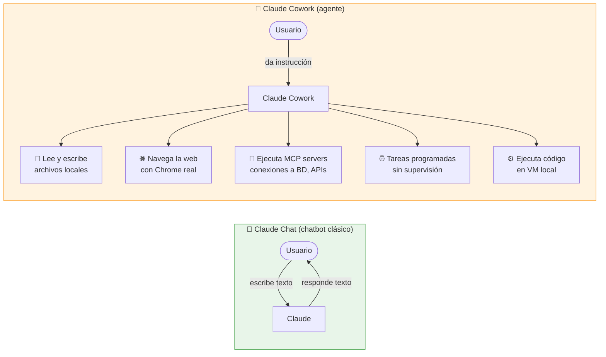
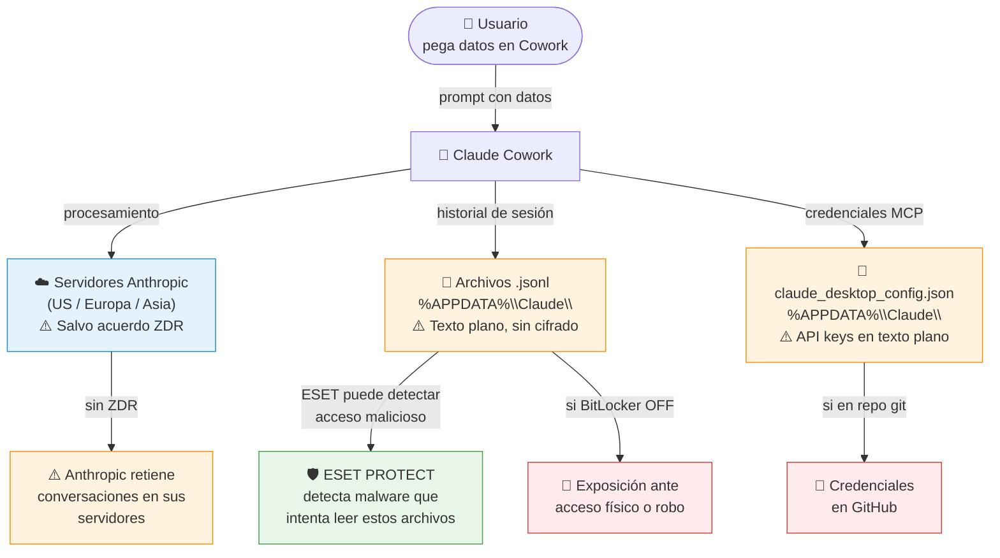
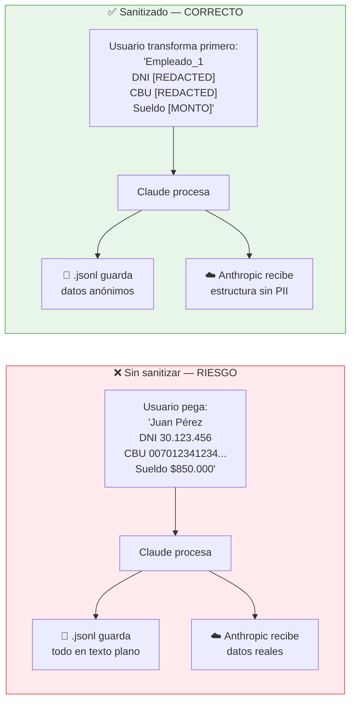
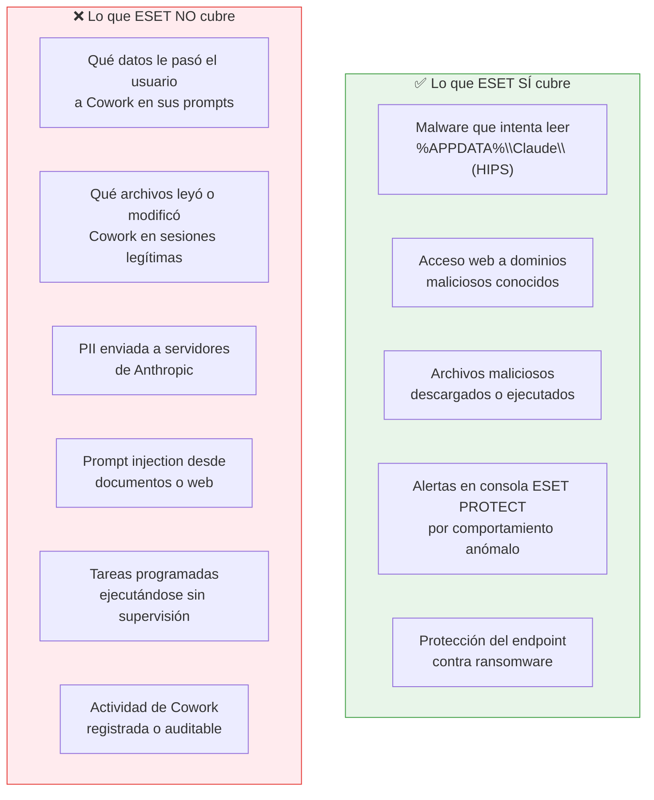
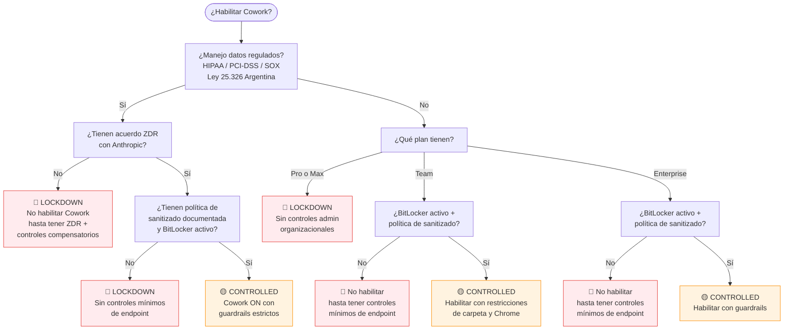

# Claude Cowork — Guía de Seguridad Empresarial

> Guía completa para equipos IT y usuarios finales sobre el uso seguro de Claude Cowork en entornos empresariales.
> Preparada por Gustavo Marcos | Abril 2026
>
> **Entorno de referencia:** Sin OTel ni SIEM. Protección de endpoint con ESET PROTECT Entry (Endpoint & Server Security).

---

## Índice

1. [¿Qué es Claude Cowork y por qué es diferente?](#1-qué-es-claude-cowork-y-por-qué-es-diferente)
2. [¿A dónde van los datos?](#2-a-dónde-van-los-datos)
3. [El problema del PII sin sanitizar](#3-el-problema-del-pii-sin-sanitizar)
4. [Visibilidad real con ESET — qué cubre y qué no](#4-visibilidad-real-con-eset--qué-cubre-y-qué-no)
5. [¿Puedo habilitar Cowork?](#5-puedo-habilitar-cowork)
6. [Mapa de controles de seguridad](#6-mapa-de-controles-de-seguridad)
7. [Evidencias a solicitar para auditoría (equipo IT)](#7-evidencias-a-solicitar-para-auditoría-equipo-it)
8. [Guía de uso seguro para usuarios](#8-guía-de-uso-seguro-para-usuarios)

---

## 1. ¿Qué es Claude Cowork y por qué es diferente?

Claude Cowork no es un chatbot. A diferencia del chat web, Cowork puede tomar acciones directas sobre el sistema.



> **Mensaje clave:** Cowork toma acciones reales en el sistema. El riesgo es radicalmente distinto al de un chatbot.

---

## 2. ¿A dónde van los datos?



**Puntos críticos:**

- El historial de conversaciones queda en cada endpoint en **texto plano** — no está cifrado por Cowork
- La Compliance API y los Audit Logs de Anthropic **excluyen Cowork completamente**
- Las credenciales de MCP servers se guardan en `claude_desktop_config.json` — nunca deben ir a un repositorio git
- Sin OTel ni SIEM, **no hay registro centralizado** de qué datos procesó Cowork ni cuándo

---

## 3. El problema del PII sin sanitizar

**PII** (*Personally Identifiable Information*) son datos que identifican a una persona: DNI, CUIL/CUIT, CBU/CVU, datos médicos, salarios, emails y nombres de clientes. En Argentina aplica la **Ley 25.326**.

**"PII sin sanitizar"** significa pasarle esos datos reales a Cowork sin anonimizarlos antes. ESET no puede detectar ni prevenir este tipo de exposición — ocurre dentro de una sesión legítima del usuario.



> **Regla práctica:** Claude no necesita el valor real para hacer el trabajo — necesita la estructura. Reemplazar antes de pegar no cambia la calidad del resultado, pero elimina la exposición.

---

## 4. Visibilidad real con ESET — qué cubre y qué no

Sin OTel ni SIEM, ESET PROTECT Entry es la única capa de visibilidad disponible. Es importante entender exactamente qué protege y qué queda fuera de su alcance.



**Conclusión:** ESET protege el endpoint contra amenazas externas, pero la actividad interna de Cowork — lo que hace, lo que lee, lo que envía — es completamente opaca sin telemetría adicional. La prevención en origen (sanitizado, política de uso, restricción de carpetas) es la única defensa disponible para ese vector.

### Qué configurar en ESET para Cowork

| Configuración | Dónde | Qué hace |
|---|---|---|
| Regla HIPS: alerta si proceso externo accede a `%APPDATA%\Claude\` | ESET PROTECT → Políticas → HIPS | Detecta malware intentando robar historial de Cowork |
| Web Control: bloquear categorías de riesgo | ESET PROTECT → Políticas → Web Control | Limita a qué sitios puede navegar Chrome de Cowork |
| Exclusión de escaneo de `%APPDATA%\Claude\*.jsonl` | ESET PROTECT → Exclusiones | Evita falsos positivos en archivos de historial grandes |
| Reporte semanal de amenazas detectadas | ESET PROTECT → Informes | Visibilidad mínima de actividad por endpoint |

---

## 5. ¿Puedo habilitar Cowork?



---

## 6. Mapa de controles de seguridad

```mermaid
flowchart LR
    subgraph PREV["🛡️ Prevención"]
        P1["Sanitizado de PII\nantes de usar Cowork"]
        P2["Chrome deshabilitado\no con allowlist"]
        P3["MCP servers\nallowlisteados"]
        P4["Instrucciones globales\nantiinyección"]
        P5["Cowork restringido\na carpetas dedicadas"]
    end

    subgraph DET["👁️ Detección"]
        D1["ESET HIPS: alerta en\n%APPDATA%\\Claude\\"]
        D2["ESET Web Control:\nbloqueo de dominios"]
        D3["Revisión manual semanal\nde tareas programadas"]
        D4["Reporte semanal ESET\nde amenazas por endpoint"]
    end

    subgraph RESP["🚨 Respuesta"]
        R1["Kill-switch:\nCowork OFF desde admin"]
        R2["Aislamiento de endpoint\ndesde ESET PROTECT"]
        R3["Rotación de credenciales\nMCP servers"]
    end

    subgraph BASE["🏗️ Base mínima requerida"]
        B1["BitLocker en endpoints"]
        B2["ESET PROTECT Entry\nactivo y actualizado"]
        B3["Política de sanitizado\ndocumentada y comunicada"]
        B4["Training obligatorio\na usuarios"]
    end

    BASE --> PREV
    BASE --> DET
    PREV --> DET
    DET --> RESP
```



---

## 7. Evidencias a solicitar para auditoría (equipo IT)

> **Contexto crítico:** Sin OTel ni SIEM, la actividad de Cowork no deja rastro centralizado. La auditoría se limita a verificar controles preventivos y el estado del endpoint.

### 7.1 Archivos de configuración (por endpoint)

| Archivo | Ruta en Windows | Por qué importa |
|---|---|---|
| `settings.json` | `%USERPROFILE%\.claude\settings.json` | Verifica restricciones de carpetas (`deny`) configuradas |
| `claude_desktop_config.json` | `%APPDATA%\Claude\claude_desktop_config.json` | Credenciales de MCP servers — no deben tener valores hardcodeados |
| `*.jsonl` (historial) | `%APPDATA%\Claude\` | Todo lo que Claude procesó — texto plano; verificar que BitLocker esté activo |
| `managed-mcp.json` | Desplegado por MDM/GPO | Inventario de MCP servers aprobados |

### 7.2 Estado del endpoint — verificaciones mínimas

| Control | Comando de verificación | Estado requerido |
|---|---|---|
| BitLocker activo | `manage-bde -status C:` | `Protection On` |
| ESET activo y actualizado | Consola ESET PROTECT | Sin endpoints con detecciones sin resolver |
| Reglas HIPS para `%APPDATA%\Claude\` | ESET PROTECT → Políticas → HIPS | Regla de alerta configurada |
| Web Control activo | ESET PROTECT → Políticas | Categorías de riesgo bloqueadas |
| Cowork restringido a carpetas dedicadas | `settings.json` → campo `deny` | Paths sensibles en lista de denegación |

### 7.3 Configuración del Admin Panel de Claude

- Toggle de Cowork: ON / OFF
- Chrome: habilitado / deshabilitado / allowlist de dominios
- Conectores activos: email, Slack, calendar, etc.
- Instrucciones globales: system prompts defensivos configurados

### 7.4 Inventario de tareas programadas

Sin OTel, las tareas programadas son completamente opacas. Verificar:

- Lista de tareas activas por usuario (desde el panel de Cowork)
- Que ninguna tenga permisos de escritura, envío de mail o publicación de contenido
- Que el usuario responsable las revise manualmente cada semana

### 7.5 Brechas que no pueden cerrarse sin OTel

| Dato | Disponibilidad | Impacto |
|---|---|---|
| Registro de qué datos procesó Cowork | **No disponible** | Un incidente de PII es indetectable hasta que hay daño |
| Historial de conversaciones centralizado | **No disponible** | Local en cada endpoint en texto plano |
| Cowork en Compliance API de Anthropic | **No disponible** | Excluido por Anthropic — sin fecha de cierre |
| Detección de prompt injection | **No disponible** | ESET no analiza el contenido de los prompts |
| Actividad de tareas programadas | **No disponible** | Cero visibilidad sobre ejecuciones automáticas |

### 7.6 Evaluación de riesgo

| Postura detectada | Riesgo | Acción recomendada |
|---|---|---|
| BitLocker inactivo en endpoints con Cowork | Crítico | Historial en texto plano expuesto ante robo o acceso físico |
| Sin política de sanitizado documentada | Alto | Usuarios no saben qué pueden pasarle a Cowork |
| PII encontrada en archivos `.jsonl` | Alto | Implementar política de sanitizado de inmediato |
| Chrome habilitado sin allowlist | Alto | Superficie de prompt injection amplia |
| Tareas programadas con permisos de escritura | Alto | Ejecución no supervisada con capacidad de modificar archivos |
| MCP servers sin allowlist central | Alto | CVEs documentados; riesgo supply chain |
| ESET sin reglas HIPS para `%APPDATA%\Claude\` | Medio | Sin detección de acceso malicioso al historial |
| Sin instrucciones globales antiinyección | Medio | Sin mitigación de prompt injection |

### 7.7 Conclusión para este entorno

Con solo ESET PROTECT Entry y sin OTel/SIEM, **la prevención es la única defensa real**. No hay forma de detectar retroactivamente qué datos procesó Cowork ni cuándo.

El mínimo aceptable antes de habilitar Cowork en este entorno es:

1. **BitLocker activo** en todos los endpoints que usen Cowork
2. **Política de sanitizado documentada** y comunicada formalmente a los usuarios
3. **Cowork restringido a carpetas dedicadas** via `settings.json`
4. **Chrome deshabilitado o con allowlist estricto** desde el Admin Panel
5. **Regla HIPS en ESET** para alertar sobre acceso externo a `%APPDATA%\Claude\`

Sin estos 5 puntos: no habilitar Cowork.

---

## 8. Guía de uso seguro para usuarios

> Para empleados que usan Claude Cowork en su trabajo diario. No requiere conocimientos técnicos.

### Lo primero que tenés que saber

Claude Cowork no es como buscar en Google o usar un chatbot. Cuando le das una instrucción, puede:

- Abrir y modificar archivos de tu computadora
- Navegar sitios web en tu nombre
- Conectarse a sistemas internos de la empresa
- Ejecutar tareas mientras vos no estás mirando

Esto lo hace muy útil — pero también significa que **lo que le decís y lo que le mostrás importa más de lo que parece.**

> El antivirus (ESET) no puede ver qué datos le pasás a Cowork ni qué hace con ellos en una sesión normal. La única protección en ese punto sos vos.

---

### Las 5 reglas de uso

#### Regla 1 — Nunca le pases estos datos directamente

Antes de pegar cualquier cosa en Cowork, revisá que no contenga:

| Tipo de dato | Ejemplos concretos |
|---|---|
| Documentos de identidad | DNI, CUIL, CUIT, pasaporte |
| Datos bancarios | CBU, CVU, número de tarjeta, claves |
| Datos de salud | Diagnósticos, historiales clínicos, resultados de laboratorio |
| Contraseñas y claves | Contraseñas de sistemas, API keys, tokens |
| Información salarial individual | Recibos de sueldo con montos, contratos con cifras |
| Datos de clientes identificables | Nombre + teléfono + email en conjunto |

> Si el trabajo lo requiere, hay una forma de hacerlo igual — ver Regla 2.

#### Regla 2 — Sanitizá antes de pegar

"Sanitizar" significa reemplazar los datos sensibles por un placeholder antes de pegarlo en Cowork. Claude puede hacer el trabajo igual — no necesita el valor real, necesita la estructura.

**Ejemplo práctico:**

En vez de pegar esto:

```
Juan Pérez | DNI 30.123.456 | CUIL 20-30123456-7 | Sueldo $850.000
María López | DNI 27.890.123 | CUIL 27-27890123-4 | Sueldo $920.000
```

Pegás esto:

```
Empleado_1 | DNI [REDACTED] | CUIL [REDACTED] | Sueldo [MONTO_1]
Empleado_2 | DNI [REDACTED] | CUIL [REDACTED] | Sueldo [MONTO_2]
```

**Otra opción:** describir el dato en lugar de pegarlo.

> *"Tengo una planilla con 50 empleados que tiene columnas nombre, DNI, CUIL y sueldo. Quiero una fórmula para calcular..."*

#### Regla 3 — Controlá a qué carpetas le das acceso

Cuando Cowork te pide acceso a carpetas, dale acceso solo a lo que necesita para esa tarea. No le des acceso a:

- Tu carpeta de Documentos completa si solo necesita un archivo
- Carpetas con contratos, legajos o información de clientes si la tarea no los requiere
- La raíz del disco (`C:\`) — nunca es necesario

#### Regla 4 — No confirmes acciones que no entendés

Si Cowork te pide confirmar algo que no reconocés o no solicitaste:

1. No confirmes
2. Cancelá la sesión
3. Avisale a tu referente IT

Esto puede ser un caso de **prompt injection**: una instrucción oculta en un documento o página web que intentó redirigir a Claude para que haga algo que vos no pediste.

> **Señal de alerta:** Cowork quiere hacer algo que no tiene nada que ver con lo que le pediste, o actúa "por su cuenta".

#### Regla 5 — Las tareas programadas necesitan más cuidado

Si configurás una tarea automática, tené en cuenta:

- Corre sola, sin que vos estés mirando
- El antivirus no puede detectar si Claude recibe instrucciones maliciosas dentro de una tarea
- Revisá periódicamente qué tareas tenés activas y si siguen haciendo lo que esperás

**Recomendación:** las tareas programadas solo deben leer información — no enviar mails, no modificar archivos, no publicar contenido.

---

### Qué podés usar sin preocuparte

| Tarea | Por qué es segura |
|---|---|
| Resumir un documento propio | No involucra datos de terceros ni sistemas externos |
| Redactar borradores de texto | Solo genera contenido, no accede a sistemas |
| Analizar una planilla con datos sanitizados | Los datos reales no salen de tu control |
| Investigar un tema en la web | Actividad acotada, sin acceso a sistemas internos |
| Formatear o reorganizar documentos | Tarea local, sin envío de datos |
| Generar código o fórmulas | No involucra datos sensibles |

---

### Señales de que algo no está bien

Prestá atención si Cowork:

- Quiere acceder a carpetas que no mencionaste
- Intenta enviar información fuera de la empresa sin que vos lo hayas pedido
- Hace preguntas raras o actúa de forma inconsistente
- Pide credenciales, contraseñas o accesos a sistemas
- Genera texto que parece de un tercero intentando darte instrucciones

En cualquiera de estos casos: **cerrá la sesión y avisale a IT.**

---

### Preguntas frecuentes

**¿El antivirus me protege de lo que hago en Cowork?**
Parcialmente. ESET detecta malware que intente robar tus archivos de Cowork, y bloquea sitios maliciosos. Pero no puede ver qué datos le pasás a Claude ni qué hace Claude con ellos en una sesión normal. La prevención depende de vos.

**¿Cowork guarda todo lo que le muestro?**
Sí. El historial queda guardado en tu computadora en texto plano. Si alguien accede a tu máquina, puede ver todo lo que hablaste con Cowork.

**¿Anthropic puede ver mis conversaciones?**
Sí, salvo que tu empresa tenga un acuerdo especial llamado ZDR. Si no sabés si lo tienen, consultá con IT antes de trabajar con información sensible.

**¿Puedo usarlo para procesar datos de clientes?**
Depende del tipo de dato. La regla general: si los datos están sujetos a la Ley 25.326 (datos personales en Argentina), sanitizá primero o consultá con IT.

**¿Qué hago si no sé si un dato es sensible o no?**
Si tenés duda, sanitizá. Reemplazar un valor por `[REDACTED]` no arruina el trabajo — evita un problema potencial.

**¿Puedo darle acceso a mi mail?**
Técnicamente sí si el conector está habilitado. Pero tu mail puede contener información de clientes, datos de salud, información legal. Si lo hacés, configurá la tarea para que solo lea, nunca envíe.

---

### Resumen rápido

```
LO QUE NUNCA HACÉS:
✗ Pegar DNI, CUIL, CBU, contraseñas, datos médicos o salariales sin sanitizar
✗ Darle acceso a carpetas completas cuando solo necesita un archivo
✗ Confirmar acciones que no reconocés o no pediste
✗ Dejar tareas programadas con permisos de escritura o envío

LO QUE SIEMPRE HACÉS:
✓ Reemplazar datos sensibles por [REDACTED] o [MONTO] antes de pegar
✓ Darle acceso solo a la carpeta del proyecto
✓ Revisar periódicamente las tareas programadas activas
✓ Avisar a IT ante cualquier comportamiento raro

ANTE LA DUDA:
→ Sanitizá primero
→ Consultá con IT
→ Cerrá la sesión si algo no cierra
```

---

*Gustavo Marcos | Abril 2026 | Basado en Harmonic Security — Securing Claude Cowork (Ed Merrett, marzo 2026)*
