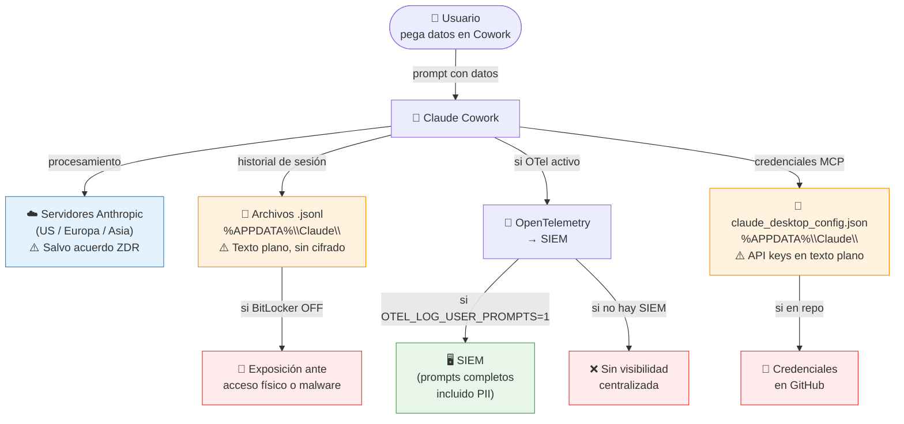
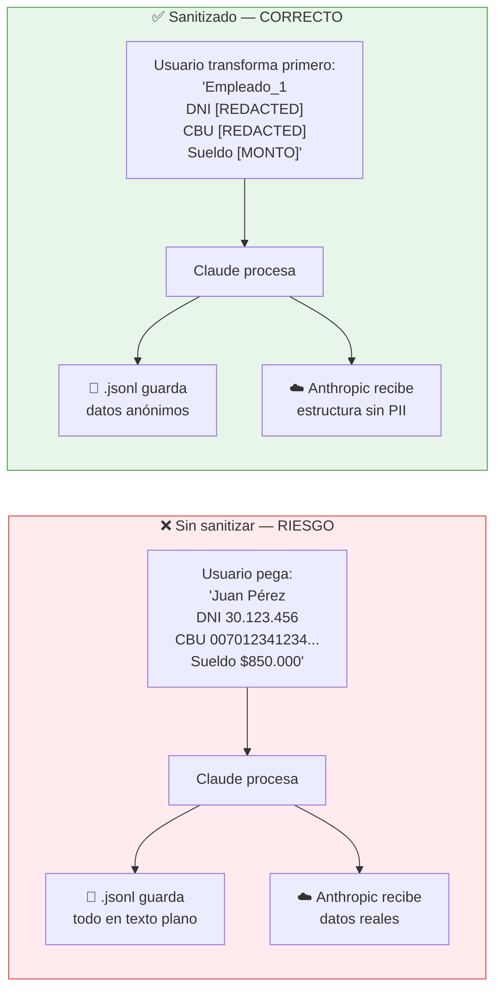
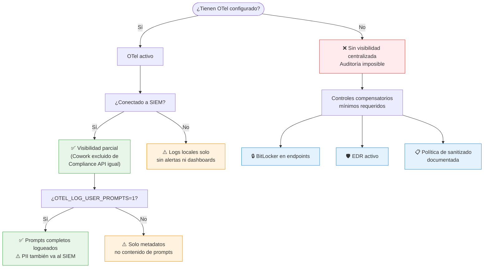
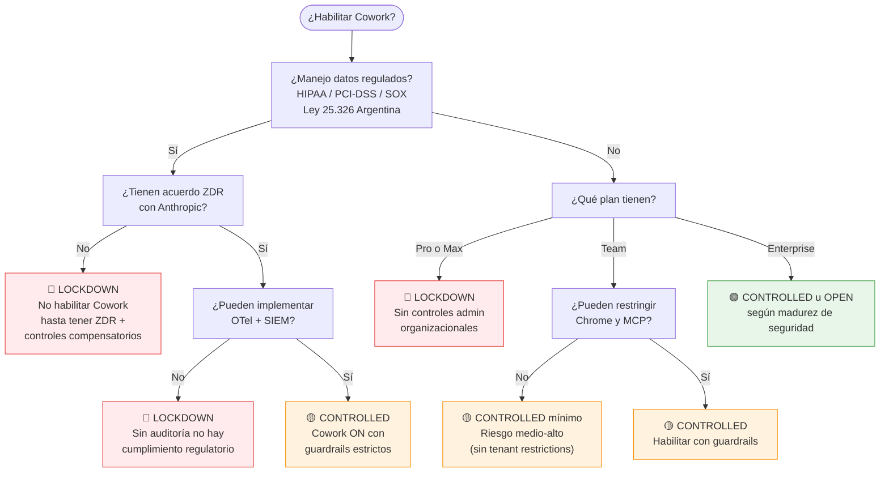

# Claude Cowork — Guía de Seguridad Empresarial

> Guía completa para equipos IT y usuarios finales sobre el uso seguro de Claude Cowork en entornos empresariales.
> Preparada por Gustavo Marcos | Abril 2026

---

## Índice

1. [¿Qué es Claude Cowork y por qué es diferente?](#1-qué-es-claude-cowork-y-por-qué-es-diferente)
2. [¿A dónde van los datos?](#2-a-dónde-van-los-datos)
3. [El problema del PII sin sanitizar](#3-el-problema-del-pii-sin-sanitizar)
4. [Visibilidad y auditoría: con y sin SIEM](#4-visibilidad-y-auditoría-con-y-sin-siem)
5. [¿Puedo habilitar Cowork?](#5-puedo-habilitar-cowork)
6. [Mapa de controles de seguridad](#6-mapa-de-controles-de-seguridad)
7. [Evidencias a solicitar para auditoría (equipo IT)](#7-evidencias-a-solicitar-para-auditoría-equipo-it)
8. [Guía de uso seguro para usuarios](#8-guía-de-uso-seguro-para-usuarios)

---

## 1. ¿Qué es Claude Cowork y por qué es diferente?

Claude Cowork no es un chatbot. A diferencia del chat web, Cowork puede tomar acciones directas sobre el sistema.


> **Mensaje clave:** Cowork toma acciones reales en el sistema. El riesgo es radicalmente distinto al de un chatbot.

---

## 2. ¿A dónde van los datos?



**Puntos críticos:**

- El historial de conversaciones queda en cada endpoint en **texto plano** — no está cifrado por Cowork
- La Compliance API y los Audit Logs de Anthropic **excluyen Cowork completamente**
- Las credenciales de MCP servers se guardan en `claude_desktop_config.json` — nunca deben ir a un repositorio git

---

## 3. El problema del PII sin sanitizar

**PII** (*Personally Identifiable Information*) son datos que identifican a una persona: DNI, CUIL/CUIT, CBU/CVU, datos médicos, salarios, emails y nombres de clientes. En Argentina aplica la **Ley 25.326**.

**"PII sin sanitizar"** significa pasarle esos datos reales a Cowork sin anonimizarlos antes.



> **Regla práctica:** Claude no necesita el valor real para hacer el trabajo — necesita la estructura. Reemplazar antes de pegar no cambia la calidad del resultado, pero elimina la exposición.

---

## 4. Visibilidad y auditoría: con y sin SIEM



**Sin SIEM:** la superficie de riesgo es equivalente pero la detección es nula. El foco se desplaza a controles de endpoint y prevención en origen.

---

## 5. ¿Puedo habilitar Cowork?



---

## 6. Mapa de controles de seguridad

```mermaid
flowchart LR
    subgraph PREV["🛡️ Prevención"]
        P1["Sanitizado de PII\nantes de usar Cowork"]
        P2["Chrome deshabilitado\no con allowlist"]
        P3["MCP servers\nallowlisteados"]
        P4["Instrucciones globales\nantiinyección"]
        P5["Tenant restrictions\n(Enterprise)"]
    end

    subgraph DET["👁️ Detección"]
        D1["OpenTelemetry\n→ SIEM"]
        D2["EDR con alerta en\n%APPDATA%\\Claude\\"]
        D3["Revisión semanal\nde tareas programadas"]
    end

    subgraph RESP["🚨 Respuesta"]
        R1["Kill-switch:\nCowork OFF desde admin"]
        R2["Playbook de IR\npara incidentes Cowork"]
        R3["Rotación de credenciales\nMCP servers"]
    end

    subgraph BASE["🏗️ Base"]
        B1["BitLocker en endpoints"]
        B2["SSO + SCIM"]
        B3["Política de clasificación\nde datos documentada"]
        B4["Training obligatorio\na usuarios"]
    end

    BASE --> PREV
    BASE --> DET
    PREV --> DET
    DET --> RESP
```



---

## 7. Evidencias a solicitar para auditoría (equipo IT)

> **Contexto crítico:** La Compliance API y los Audit Logs de Anthropic excluyen Cowork completamente. La única fuente de telemetría disponible es OpenTelemetry.

### 7.1 Archivos de configuración (por endpoint)

| Archivo | Ruta en Windows | Por qué importa |
|---|---|---|
| `settings.json` | `%USERPROFILE%\.claude\settings.json` | Configuración local; vector de ataque CVE-2025-59536 |
| `claude_desktop_config.json` | `%APPDATA%\Claude\claude_desktop_config.json` | Credenciales de MCP servers hardcodeadas |
| `*.jsonl` (historial) | `%APPDATA%\Claude\` | Todo lo que Claude leyó, escribió y ejecutó — texto plano |
| `.claude.json` | `%USERPROFILE%\.claude.json` | Repos marcados como "confiables" |
| `managed-mcp.json` | Desplegado por MDM/GPO | Inventario centralizado de MCP servers aprobados |
| `.mcp.json` | Por repo clonado | Puede contener hooks maliciosos |

### 7.2 Telemetría

**Con OTel + SIEM:**
- Variable `OTEL_EXPORTER_OTLP_ENDPOINT` configurada
- Variable `OTEL_LOG_USER_PROMPTS` — si = `1`, prompts completos se loguean (incluido PII)
- Dashboards y alertas activas en SIEM

**Sin SIEM — controles compensatorios mínimos:**

| Control | Cómo verificarlo | Sin esto el riesgo es |
|---|---|---|
| BitLocker activo | `manage-bde -status C:` | Historial `.jsonl` expuesto ante acceso físico |
| EDR instalado | Panel del agente EDR | Sin detección de acceso a `%APPDATA%\Claude\` |
| Directorio Claude en backup cifrado | Política de backup | Pérdida o exposición del historial |
| Cowork restringido a carpetas dedicadas | `settings.json` → campo `deny` | Acceso irrestricto al filesystem |
| `.gitignore` global con archivos Claude | `~/.gitconfig` → `core.excludesfile` | Credenciales pusheadas a repos |

### 7.3 Configuración del Admin Panel

- Toggle de Cowork: ON / OFF
- Chrome: habilitado / deshabilitado / allowlist de dominios
- Conectores activos: email, Slack, calendar, etc.
- Tenant restrictions (solo Enterprise): header `anthropic-allowed-org-ids`
- Instrucciones globales: system prompts defensivos

### 7.4 Inventario de tareas programadas

Las tareas corren sin supervisión — son la superficie de ataque más opaca.

- Lista de tareas activas por usuario
- Permisos: read-only vs. write/execute
- Historial de ejecuciones (OTel o `.jsonl` local)

### 7.5 Configuración de red

- Confirmar si `anthropic.com` está en allowlists del proxy — es canal de exfiltración potencial
- Dominios hardcodeados por Anthropic: `api.anthropic.com`, `pypi.org`, `github.com`, `npmjs.org`
- Categorías bloqueadas en browser (por defecto NO incluye: portales de salud, consolas cloud, SSO admin)

### 7.6 Brechas estructurales — lo que no podrás obtener

| Dato buscado | Disponibilidad | Motivo |
|---|---|---|
| Historial de conversaciones centralizado | **No disponible** | Local en cada endpoint |
| Cowork en Compliance API | **No disponible** | Excluido por Anthropic — sin fecha de cierre |
| Cowork en Data Exports | **No disponible** | Ídem |
| Granularidad por usuario en controles | **No disponible** | Controles son todos-o-nadie |
| Residencia de datos regional | Solo via Bedrock / Vertex / Azure | Por defecto: US/Europa/Asia |

### 7.7 Evaluación de riesgo por postura

| Postura detectada | Riesgo | Acción recomendada |
|---|---|---|
| Sin OTel ni SIEM | Crítico | Foco en controles de endpoint |
| PII sin sanitizar en historial `.jsonl` | Alto | Política de sanitizado + BitLocker |
| Sin BitLocker en endpoints con Cowork | Alto | Historial en texto plano expuesto |
| Chrome habilitado sin allowlist | Alto | Superficie de prompt injection amplia |
| Tareas programadas sin restricción | Alto | Ejecución no supervisada |
| Sin tenant restrictions (plan Team) | Medio-Alto | Cuentas personales acceden a datos org |
| MCP servers sin allowlist central | Alto | CVEs documentados; riesgo supply chain |
| Sin política de clasificación de datos | Alto | Usuarios no saben qué pasarle a Cowork |

### 7.8 Conclusión para industrias reguladas

Para organizaciones en **salud, finanzas o legal**: la brecha de auditoría es razón técnica suficiente para recomendar postura **Lockdown** (Cowork OFF) hasta que Anthropic cierre el gap en Compliance API.

Para clientes **sin SIEM y con datos regulados**: el mínimo aceptable antes de habilitar Cowork es **BitLocker + EDR + política de sanitizado documentada y comunicada a usuarios**.

---

## 8. Guía de uso seguro para usuarios

> Para empleados que usan Claude Cowork en su trabajo diario. No requiere conocimientos técnicos.

### Lo primero que tenés que saber

Claude Cowork no es como buscar en Google o usar un chatbot. Cuando le das una instrucción, puede:

- Abrir y modificar archivos de tu computadora
- Navegar sitios web en tu nombre
- Conectarse a sistemas internos de la empresa
- Ejecutar tareas mientras vos no estás mirando

Esto lo hace muy útil — pero también significa que **lo que le decís y lo que le mostrás importa más de lo que parece.**

---

### Las 5 reglas de uso

#### Regla 1 — Nunca le pases estos datos directamente

Antes de pegar cualquier cosa en Cowork, revisá que no contenga:

| Tipo de dato | Ejemplos concretos |
|---|---|
| Documentos de identidad | DNI, CUIL, CUIT, pasaporte |
| Datos bancarios | CBU, CVU, número de tarjeta, claves |
| Datos de salud | Diagnósticos, historiales clínicos, resultados de laboratorio |
| Contraseñas y claves | Contraseñas de sistemas, API keys, tokens |
| Información salarial individual | Recibos de sueldo con montos, contratos con cifras |
| Datos de clientes identificables | Nombre + teléfono + email en conjunto |

> Si el trabajo lo requiere, hay una forma de hacerlo igual — ver Regla 2.

#### Regla 2 — Sanitizá antes de pegar

"Sanitizar" significa reemplazar los datos sensibles por un placeholder antes de pegarlo en Cowork. Claude puede hacer el trabajo igual — no necesita el valor real, necesita la estructura.

**Ejemplo práctico:**

En vez de pegar esto:

```
Juan Pérez | DNI 30.123.456 | CUIL 20-30123456-7 | Sueldo $850.000
María López | DNI 27.890.123 | CUIL 27-27890123-4 | Sueldo $920.000
```

Pegás esto:

```
Empleado_1 | DNI [REDACTED] | CUIL [REDACTED] | Sueldo [MONTO_1]
Empleado_2 | DNI [REDACTED] | CUIL [REDACTED] | Sueldo [MONTO_2]
```

**Otra opción:** describir el dato en lugar de pegarlo.

> *"Tengo una planilla con 50 empleados que tiene columnas nombre, DNI, CUIL y sueldo. Quiero una fórmula para calcular..."*

#### Regla 3 — Controlá a qué carpetas le das acceso

Cuando Cowork te pide acceso a carpetas, dale acceso solo a lo que necesita para esa tarea. No le des acceso a:

- Tu carpeta de Documentos completa si solo necesita un archivo
- Carpetas con contratos, legajos o información de clientes si la tarea no los requiere
- La raíz del disco (`C:\`) — nunca es necesario

#### Regla 4 — No confirmes acciones que no entendés

Si Cowork te pide confirmar algo que no reconocés o no solicitaste:

1. No confirmes
2. Cancelá la sesión
3. Avisale a tu referente IT

Esto puede ser un caso de **prompt injection**: una instrucción oculta en un documento o página web que intentó redirigir a Claude.

> **Señal de alerta:** Cowork quiere hacer algo que no tiene nada que ver con lo que le pediste, o actúa "por su cuenta".

#### Regla 5 — Las tareas programadas necesitan más cuidado

Si configurás una tarea automática, tené en cuenta:

- Corre sola, sin que vos estés mirando
- Si Claude recibe instrucciones maliciosas vía un mail o documento, puede actuar sobre ellas sin que te enteres
- Revisá periódicamente qué tareas tenés activas

**Recomendación:** las tareas programadas solo deben leer información — no enviar mails, no modificar archivos, no publicar contenido.

---

### Qué podés usar sin preocuparte

| Tarea | Por qué es segura |
|---|---|
| Resumir un documento propio | No involucra datos de terceros ni sistemas externos |
| Redactar borradores de texto | Solo genera contenido, no accede a sistemas |
| Analizar una planilla con datos sanitizados | Los datos reales no salen de tu control |
| Investigar un tema en la web | Actividad acotada, sin acceso a sistemas internos |
| Formatear o reorganizar documentos | Tarea local, sin envío de datos |
| Generar código o fórmulas | No involucra datos sensibles |

---

### Señales de que algo no está bien

Prestá atención si Cowork:

- Quiere acceder a carpetas que no mencionaste
- Intenta enviar información fuera de la empresa sin que vos lo hayas pedido
- Hace preguntas raras o actúa de forma inconsistente
- Pide credenciales, contraseñas o accesos a sistemas
- Genera texto que parece de un tercero intentando darte instrucciones

En cualquiera de estos casos: **cerrá la sesión y avisale a IT.**

---

### Preguntas frecuentes

**¿Cowork guarda todo lo que le muestro?**
Sí. El historial queda guardado en tu computadora en texto plano. Si alguien accede a tu máquina, puede ver todo lo que hablaste con Cowork.

**¿Anthropic puede ver mis conversaciones?**
Sí, salvo que tu empresa tenga un acuerdo especial llamado ZDR. Si no sabés si lo tienen, consultá con IT antes de trabajar con información sensible.

**¿Puedo usarlo para procesar datos de clientes?**
Depende del tipo de dato. La regla general: si los datos están sujetos a la Ley 25.326 (datos personales en Argentina), sanitizá primero o consultá con IT.

**¿Qué hago si no sé si un dato es sensible o no?**
Si tenés duda, sanitizá. Reemplazar un valor por `[REDACTED]` no arruina el trabajo — evita un problema potencial.

**¿Puedo darle acceso a mi mail?**
Técnicamente sí si el conector está habilitado. Pero tu mail puede contener información de clientes, datos de salud, información legal. Si lo hacés, configurá la tarea para que solo lea, nunca envíe.

---

### Resumen rápido

```
LO QUE NUNCA HACÉS:
✗ Pegar DNI, CUIL, CBU, contraseñas, datos médicos o salariales sin sanitizar
✗ Darle acceso a carpetas completas cuando solo necesita un archivo
✗ Confirmar acciones que no reconocés o no pediste
✗ Dejar tareas programadas con permisos de escritura o envío

LO QUE SIEMPRE HACÉS:
✓ Reemplazar datos sensibles por [REDACTED] o [MONTO] antes de pegar
✓ Darle acceso solo a la carpeta del proyecto
✓ Revisar periódicamente las tareas programadas activas
✓ Avisar a IT ante cualquier comportamiento raro

ANTE LA DUDA:
→ Sanitizá primero
→ Consultá con IT
→ Cerrá la sesión si algo no cierra
```

---

*Gustavo Marcos | Abril 2026 | Basado en Harmonic Security — Securing Claude Cowork (Ed Merrett, marzo 2026)*
